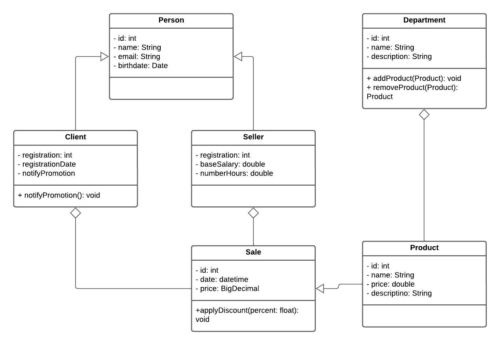

# TPPE

Projeto de refatoração para o repositório [estudo-java](https://github.com/samuel-sato/estudo-java/) para a matéria de Técnicas de Programação para Plataformas Emergentes. O intento é aplicar boas práticas de programação
como Padrões de Projeto, Arquitetura Limpa e Desenvolvimento guido por Testes.

O projeto consiste em um sistema de gestão de vendas. 

### UML

### Construção

A aplicação dos roda em 2 containers, aplicação java quarkus e o banco de dados mysql.
Antes de criar a imagem é necessário gerar o pacote para uso das bibliotecas

`./mvnw package`

Criação da imagem:

`docker-compose build`

Executar aplicação (subir containers)

`docker-compose up`

Parar aplicações:

`Ctrl + c`

# Backlog da aplicação

Entidades principais: **Cliente, Vendedor, Produto, Departamento, Venda**

---

## 👤 Cliente

- **User Story 1**  
  _"Eu como cliente gostaria de me cadastrar com meus dados pessoais para que eu possa realizar compras."_

- **User Story 2**  
  _"Eu como cliente gostaria de visualizar todos os produtos disponíveis para decidir o que comprar."_

- **User Story 3**  
  _"Eu como cliente gostaria de buscar produtos por nome ou departamento para encontrar o que preciso mais rapidamente."_

- **User Story 4**  
  _"Eu como cliente gostaria de consultar o histórico das minhas compras para acompanhar meus gastos."_

---

## 👤 Vendedor

- **User Story 5**  
  _"Eu como vendedor gostaria de me autenticar na aplicação para acessar minhas funcionalidades."_

- **User Story 6**  
  _"Eu como vendedor gostaria de registrar uma venda associando cliente, produtos e data para manter o controle comercial."_

- **User Story 7**  
  _"Eu como vendedor gostaria de visualizar o meu histórico de vendas para acompanhar minha performance."_

- **User Story 8**  
  _"Eu como vendedor gostaria de visualizar os detalhes de um cliente para oferecer um atendimento mais personalizado."_

---

## 👤 Administrador

- **User Story 9**  
  _"Eu como administrador gostaria de cadastrar e gerenciar produtos para manter o catálogo atualizado."_

- **User Story 10**  
  _"Eu como administrador gostaria de associar produtos a departamentos para organizá-los por categoria."_

- **User Story 11**  
  _"Eu como administrador gostaria de cadastrar e editar dados de vendedores para manter os registros atualizados."_

- **User Story 12**  
  _"Eu como administrador gostaria de visualizar relatórios de vendas por departamento para apoiar decisões de negócio."_

- **User Story 13**  
  _"Eu como administrador gostaria de visualizar o total de vendas por cliente para identificar clientes mais ativos."_

- **User Story 14**  
  _"Eu como administrador gostaria de inativar produtos que não serão mais vendidos para manter o sistema limpo."_

---
