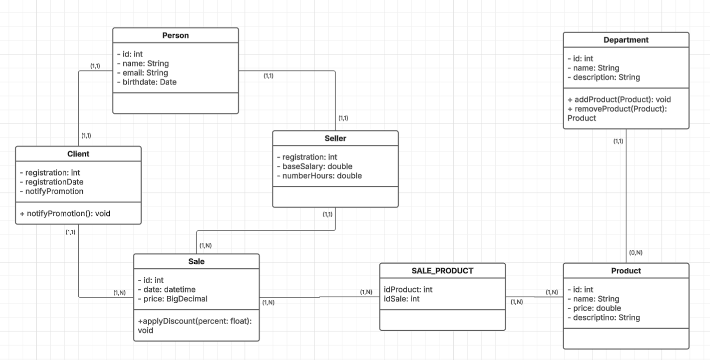

# TPPE

Projeto de refatoração para o repositório [estudo-java](https://github.com/samuel-sato/estudo-java/) para a matéria de Técnicas de Programação para Plataformas Emergentes. O intento é aplicar boas práticas de programação
como Padrões de Projeto, Arquitetura Limpa e Desenvolvimento guido por Testes.

O projeto consiste em um sistema de gestão de vendas.

---

## 🏗️ Arquitetura em Camadas (Clean Architecture)

A arquitetura deste projeto segue os princípios da **Clean Architecture** (Arquitetura Limpa), que organiza o código em **camadas concêntricas** com regras estritas de dependência. O objetivo principal é manter o código independente de frameworks, bancos de dados, UI e qualquer agente externo. Isso resulta em um sistema flexível, testável e de fácil manutenção.

No cerne da aplicação, encontramos as **Entidades** (Enterprise Business Rules), que encapsulam as regras de negócio mais importantes e invariáveis. A camada seguinte, **Use Cases** (Application Business Rules), orquestra o fluxo de dados e as interações das entidades para resolver um problema de negócio específico (as User Stories).

As camadas mais externas, como **Adapters** (Controladores, Gateways, Presenters) e **Frameworks & Drivers** (Frameworks web, bancos de dados, UI), são responsáveis por adaptar os dados para as camadas internas e vice-versa. Elas dependem das camadas internas, mas as camadas internas nunca dependem das externas. Isso garante que as regras de negócio permaneçam isoladas e protegidas de mudanças tecnológicas externas.

Esta abordagem permite um desenvolvimento mais modular, facilitando a escrita de testes unitários isolados para as regras de negócio e a substituição de componentes externos sem impactar a lógica central da aplicação.

---

### Diagrama UML

### Diagrama Físico

### Construção

A aplicação dos roda em 2 containers, aplicação java quarkus e o banco de dados mysql.
Antes de criar a imagem é necessário gerar o pacote para uso das bibliotecas

`./mvnw package`

Criação da imagem:

`docker-compose build`

Executar aplicação (subir containers)

`docker-compose up`

Parar aplicações:

`Ctrl + c`

# Backlog da aplicação

Entidades principais: **Cliente, Vendedor, Produto, Departamento, Venda**

---

## 👤 Cliente

- **User Story 1** _"Eu como cliente gostaria de me cadastrar com meus dados pessoais para que eu possa realizar compras."_

- **User Story 2** _"Eu como cliente gostaria de visualizar todos os produtos disponíveis para decidir o que comprar."_

- **User Story 3** _"Eu como cliente gostaria de buscar produtos por nome ou departamento para encontrar o que preciso mais rapidamente."_

- **User Story 4** _"Eu como cliente gostaria de consultar o histórico das minhas compras para acompanhar meus gastos."_

---

## 👤 Vendedor

- **User Story 5** _"Eu como vendedor gostaria de me autenticar na aplicação para acessar minhas funcionalidades."_

- **User Story 6** _"Eu como vendedor gostaria de registrar uma venda associando cliente, produtos e data para manter o controle comercial."_

- **User Story 7** _"Eu como vendedor gostaria de visualizar o meu histórico de vendas para acompanhar minha performance."_

- **User Story 8** _"Eu como vendedor gostaria de visualizar os detalhes de um cliente para oferecer um atendimento mais personalizado."_

---

## 👤 Administrador

- **User Story 9** _"Eu como administrador gostaria de cadastrar e gerenciar produtos para manter o catálogo atualizado."_

- **User Story 10** _"Eu como administrador gostaria de associar produtos a departamentos para organizá-los por categoria."_

- **User Story 11** _"Eu como administrador gostaria de cadastrar e editar dados de vendedores para manter os registros atualizados."_

- **User Story 12** _"Eu como administrador gostaria de visualizar relatórios de vendas por departamento para apoiar decisões de negócio."_

- **User Story 13** _"Eu como administrador gostaria de visualizar o total de vendas por cliente para identificar clientes mais ativos."_

- **User Story 14** _"Eu como administrador gostaria de inativar produtos que não serão mais vendidos para manter o sistema limpo."_